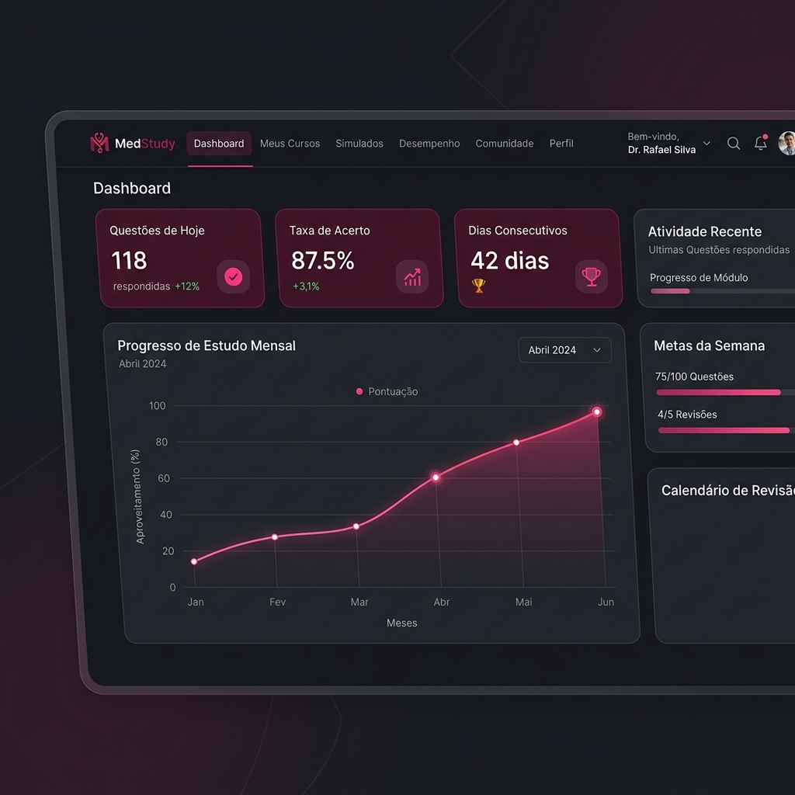

# MedStudy — Plataforma de Estudos Médicos


> **Core Value:** O MedStudy é uma plataforma moderna projetada para médicos e estudantes de medicina otimizarem sua preparação para a residência através de sessões de estudo focadas, análise de desempenho em tempo real e revisão intervalada.

---

## ✨ Features Premium

### 📊 Dashboard Inteligente
Acompanhe sua evolução mensal, taxa de acerto por grande área e mantenha sua constância com o sistema de **Streak**.


### 📂 Banco de Questões & Simulados
Gerencie seu progresso com filtros avançados por Instituição, Grande Área e Tema. Os simulados calculam automaticamente seu aproveitamento por área médica.

### 🧠 Flashcards & Revisão Espaçada
Sistema de **Active Recall** com flip cards e agendamento automático baseado na dificuldade (Fácil, Médio, Difícil).

### 🎨 Design System Dinâmico
Suporte a **8 temas de cores** (Rosa, Claro, Escuro, Verde, Azul, etc.) com transições suaves e persistência de preferência.

---

## 🛠️ Tecnologia de Ponta

- **Frontend**: [Angular 18](https://angular.dev/) (Standalone Components, NgRx, RxJS, Signals)
- **Backend**: [Spring Boot 3](https://spring.io/projects/spring-boot) (Java 21, Spring Security, JPA)
- **Database**: [PostgreSQL 16](https://www.postgresql.org/)
- **Segurança**: Autenticação via **HttpOnly Cookies**, CSRF Double Submit, CSP rígido e auditoria OWASP.

---

## 🚀 Como Começar (Setup Local)

### Pré-requisitos
- Docker e Docker Compose
- Node.js (LTS v22)
- Java 21

### 1. Preparar Ambiente
```bash
cp .env.example .env
docker-compose up -d
```

### 2. Iniciar Backend
```bash
cd backend
./mvnw spring-boot:run
```

### 3. Iniciar Frontend
```bash
cd frontend
npm install
npm start
```

Acesse em: `http://localhost:4200`

---

## 📚 Documentação Complementar

- [**Guia de Uso (Walkthrough)**](.planning/phases/15-documentacao-final-integradacao-e2e/WALKTHROUGH.md): Passo-a-passo para novos usuários.
- [**Política de Segurança**](SECURITY.md): Como reportar vulnerabilidades e detalhes do hardening.
- [**Documentação da API**](http://localhost:8080/api/docs): Swagger/OpenAPI interativo (requer backend rodando).

---

## 📄 Licença
Distribuído sob a licença MIT. Veja `LICENSE` para mais informações.
