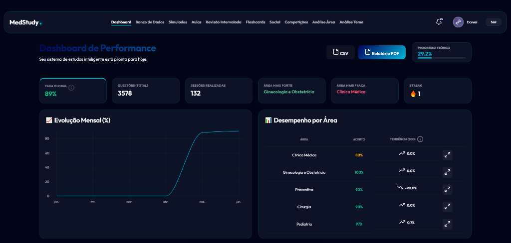
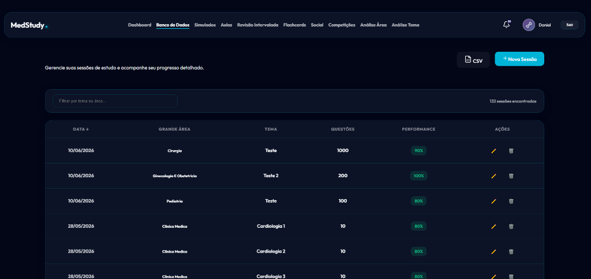
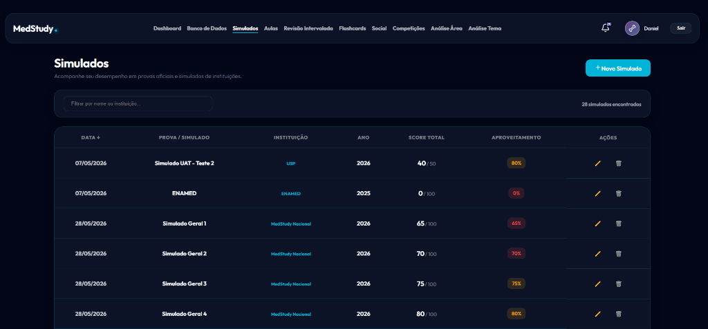
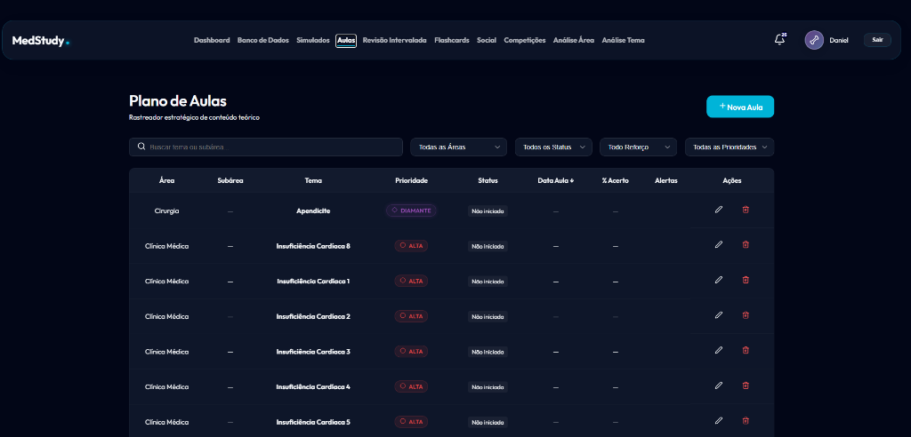
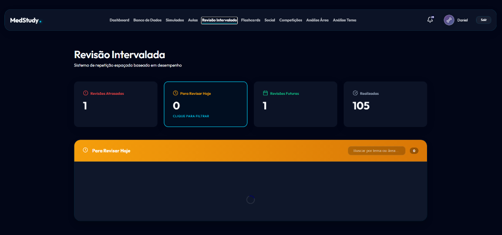
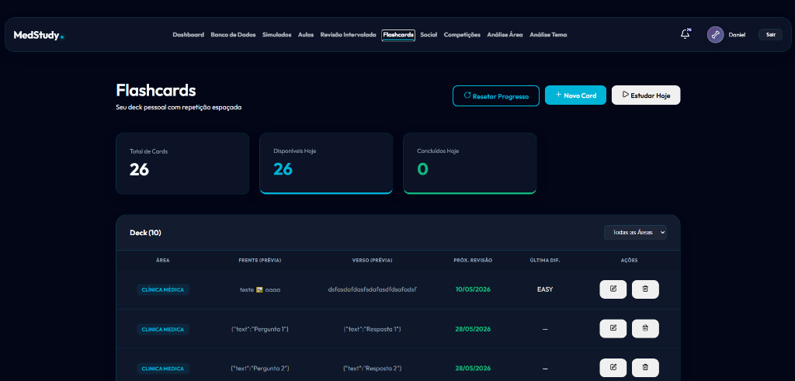
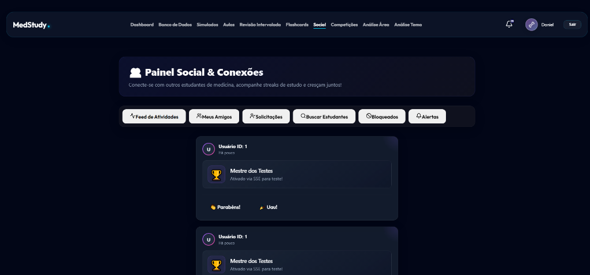
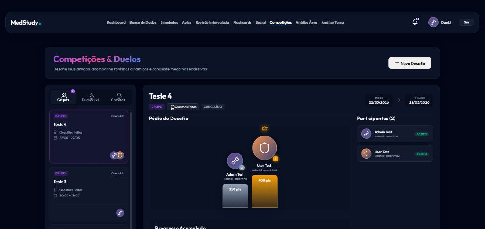
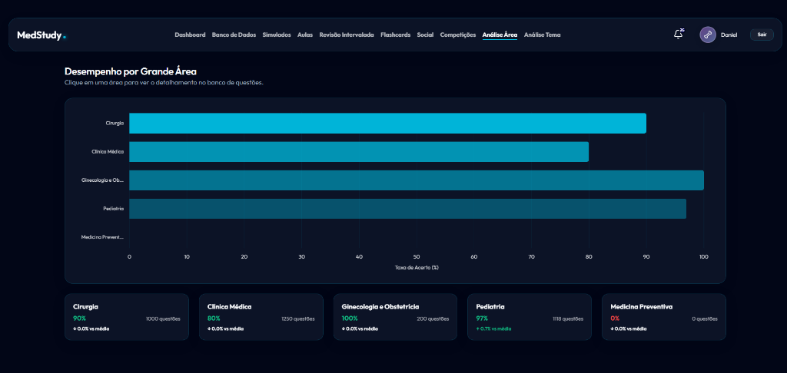

# MedStudy — Plataforma de Estudos Médicos

🚀 **Acesso Produção:** [https://medstudy-497617.web.app/login](https://medstudy-497617.web.app/login)



> **Core Value:** O MedStudy é uma plataforma inovadora e moderna projetada especificamente para médicos e estudantes de medicina otimizarem sua preparação para a residência e provas de título. Através de sessões de estudo focadas, análise de desempenho em tempo real, inteligência em retenção (revisão intervalada) e engajamento competitivo, a jornada do aluno torna-se muito mais fluida e assertiva.

---

## ✨ Módulos e Features do Sistema

O sistema foi desenhado com arquitetura modular, onde cada tela resolve uma dor específica da preparação do aluno:

### 📊 Dashboard e Visão Geral
O centro de controle do seu desempenho.
- **KPIs em Tempo Real:** Acompanhe imediatamente sua taxa global de acertos, evolução da ofensiva (Streak), e volume de estudos.
- **Evolução Mensal:** Gráficos interativos para identificar picos e vales na sua jornada.
- **Temas Críticos:** Identificação cirúrgica dos "Temas com Maior Taxa de Erro" no formato Top 10, para focar no que mais importa.
- **Conquistas e Gamificação:** Badges exclusivos por engajamento e perfeição, mantendo a motivação em alta.

### 📂 Banco de Dados de Sessões
Seu arsenal de treinamento.
- **Filtros Avançados:** Cruze Grande Área, Instituição, Tema e Subtema com apenas dois cliques.
- **Resolução Otimizada:** Interface imersiva de resolução com gabarito comentado no ato, feedback visual de erro/acerto instantâneo e design focado na absorção de conteúdo.
- **Estatísticas da Questão:** Veja o percentual geral de acerto dos outros alunos para entender o nível de dificuldade da pergunta.



### 📝 Simulados
Teste de resistência em modo de prova.
- Simule condições reais de provas de residência com tempo cronometrado.
- Revisões pós-prova com análise detalhada de performance por assunto.



### 📖 Plano de Aulas
Rastreador estratégico de conteúdo teórico.
- **Priorização Inteligente:** Classifique temas por prioridade (Diamante, Alta, Média, Baixa) para guiar seus estudos.
- **Filtros Completos:** Filtre por área, status, reforço e prioridade.
- **Acompanhamento de % de Acerto:** Vincule cada aula ao seu desempenho prático nas questões.



### 🔁 Revisão Intervalada
Sistema de repetição espaçada baseado em desempenho.
- **Agendamento Automático:** O sistema programa revisões com base na sua performance, priorizando o que você mais esquece.
- **Visão de Hoje:** Veja exatamente o que precisa revisar agora, o que está atrasado e o que vem a seguir.
- **105+ Revisões Realizadas:** Histórico completo de engajamento com o material.



### 🧠 Flashcards & Revisão Espaçada (Active Recall)
Onde a retenção de longo prazo acontece.
- **Algoritmo de Agendamento:** Avalie a dificuldade ao virar o cartão (Fácil, Médio, Difícil). O sistema programa a próxima aparição usando curvas de esquecimento.
- **Criação Descomplicada:** Adicione flashcards rapidamente de onde estiver, com suporte a tags.
- **Sessões Focadas:** Estude apenas os "Cards de Hoje", mantendo a fila em dia com máxima eficiência temporal.



### 👥 Painel Social & Conexões
Onde a comunidade impulsiona a performance.
- **Feed de Atividades:** Acompanhe conquistas e estudos dos seus colegas em tempo real.
- **Rede de Estudantes:** Adicione amigos, gerencie solicitações e busque estudantes por nome.
- **Reações Sociais:** Parabenize e motive colegas diretamente no feed.



### 🏆 Competições & Duelos
Para os que amam a energia da competição saudável.
- **Duelos 1v1:** Desafie um colega diretamente.
- **Grupos e Ligas:** Participe de rankings em grupo, acompanhe placares em tempo real e incentive seus pares a estudarem mais.
- **Pódio do Desafio:** Visualize o ranking final de cada competição com pontuação acumulada.



### 📈 Análise por Área
Inteligência analítica sobre seu desempenho por especialidade.
- **Gráfico de Barras por Grande Área:** Compare visualmente sua taxa de acerto entre Cirurgia, Clínica Médica, Ginecologia, Pediatria e mais.
- **Cards de Desempenho:** Veja questões respondidas, % de acerto e comparativo vs. média por área.
- **Drill-down para Questões:** Clique em uma área para filtrar diretamente o banco de questões.



### 🎨 Design System Dinâmico (Temas)
Seu ambiente, suas regras.
- Escolha entre **8 temas de cores exclusivos** (Rosa, Claro, Escuro, Verde, Azul, etc.).
- Suporte nativo a Light/Dark Mode integrados a cada paleta.
- Estética *Glassmorphism* Premium em todos os cards e modais.

---

## 🛠️ Stack Tecnológico

- **Frontend**: [Angular 18](https://angular.dev/) (Standalone Components, NgRx, RxJS, Signals)
- **Backend**: [Spring Boot 3](https://spring.io/projects/spring-boot) (Java 21, Spring Security, JPA)
- **Database**: [PostgreSQL 16](https://www.postgresql.org/)
- **Segurança e Performance**: Autenticação stateless, persistência resiliente, layout responsivo em grid e flexbox.

---

## 🚀 Como Começar (Setup Local)

### Pré-requisitos
- Docker e Docker Compose
- Node.js (LTS v22)
- Java 21

### 1. Preparar Ambiente
```bash
cp .env.example .env
docker-compose up -d
```

### 2. Iniciar Backend
```bash
cd backend
./mvnw spring-boot:run
```

### 3. Iniciar Frontend
```bash
cd frontend
npm install
npm run start
```

Acesse em: `http://localhost:4200`

---

## 📚 Documentação Complementar

- [**Política de Segurança**](./SECURITY.md): Como reportar vulnerabilidades e detalhes do hardening.
- [**Documentação da API**](http://localhost:8080/swagger-ui/index.html#/): Swagger/OpenAPI interativo (requer backend rodando).

---

## 📄 Licença
Distribuído sob a licença MIT. Veja `LICENSE` para mais informações.
